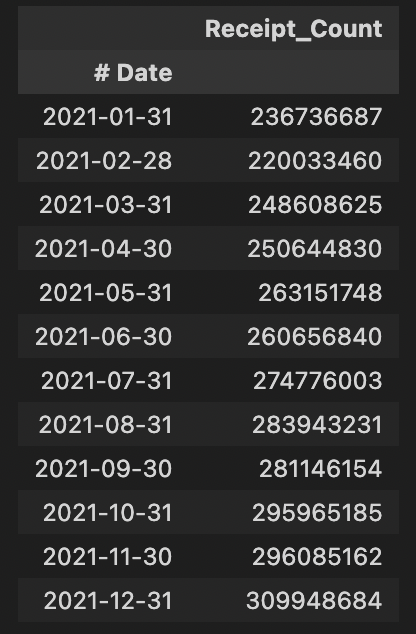
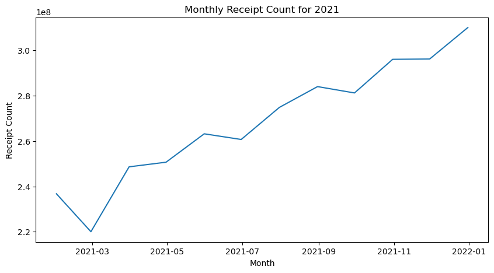
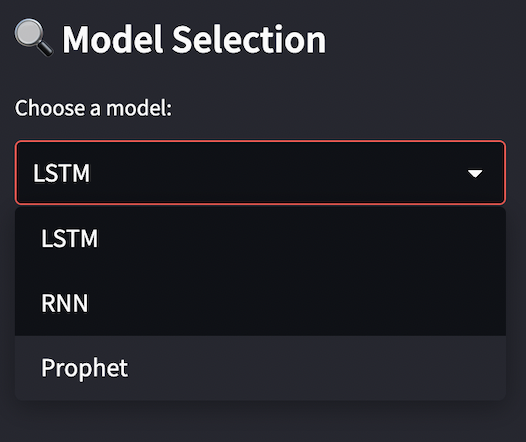
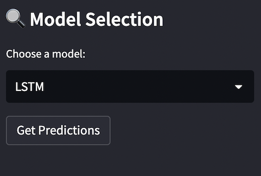
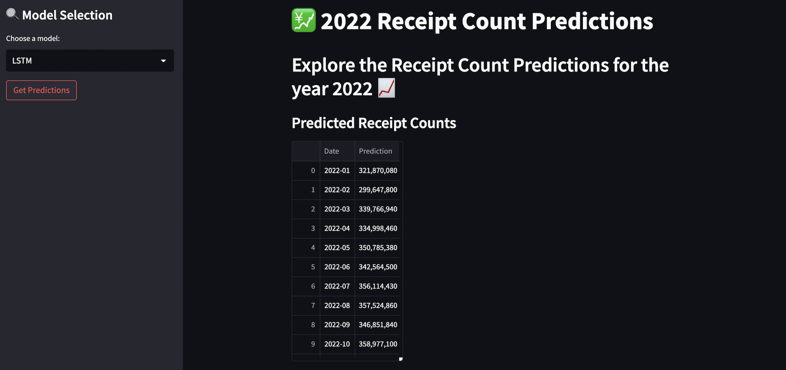
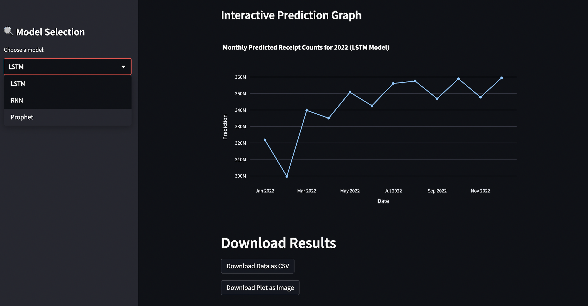
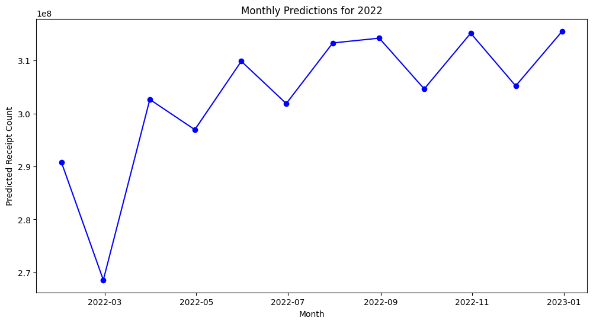
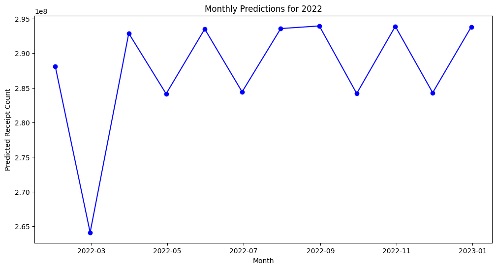
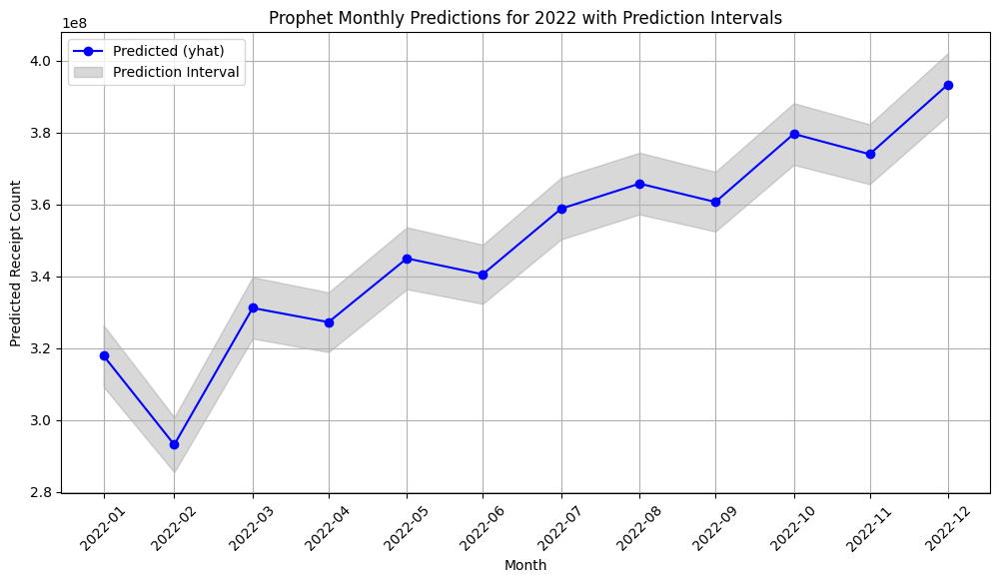

# Fetch Receipt Count Project

## Table of Contents
1. [Overview](#overview)
2. [Problem Statement](#problem-statement)
3. [Repository Structure](#repository-structure)
4. [Data Overview](#data-overview)
5. [How to Run](#how-to-run)
   - [Web Application](#web-application)
   - [Using Docker Hub](#using-docker-hub)
6. [Using the Application](#using-the-application)
7. [Hugging Face Inference](#hugging-face-inference)
8. [Models Used](#models-used)
9. [Model Results](#model-results)
10. [Contributions](#contributions)
11. [Contact](#contact)

## Overview

Welcome to the Fetch Receipt Count Prediction Repository! This project is focused on predicting the future number of scanned receipts based on historical data. It includes a machine learning model and a user-friendly web application for visualization.

## Problem Statement

The objective is to predict the number of scanned receipts for each month of the year 2022, using daily receipt count data from 2021. This solution demonstrates the application of machine learning techniques and is packaged as a web application for ease of interaction and visualization.

## Repository Structure

- `Streamlit/`
  - `app.py`: The Streamlit application for visualization.
- `main/`
  - `__pycache__/`
  - `__init__.py`
  - `fetch-modeling.ipynb`: Jupyter Notebook for modeling and analysis.
  - `predictions.py`: Script for generating predictions.
  - `train.py`: Training script for ML models.
  - `utils.py`: Utility functions used across the project.
- `results/`: Contains the results of predictions.
  - `LSTM_predictions-final.csv`
  - `Prophet_predictions.csv`
  - `RNN_predictions-final.csv`
- `trained_models/`: Trained model files.
  - `LSTM.h5`
  - `RNN.h5`
  - `prophet.pkl`
- `unit_tests/`
  - `unit_test.py`: Unit tests for the codebase.
- `Dockerfile`: Docker configuration file.
- `README.md`: Documentation of the project.
- `data_daily.csv`: Dataset used for training and predictions.
- `requirements.txt`: Required libraries and dependencies.

## Data Overview

### Data Description

The project utilizes a comprehensive dataset of daily scanned receipt counts for the year 2021. This dataset is crucial for understanding customer engagement and predicting future trends.

### Monthly Aggregated Data

For a more streamlined view, the daily data has been aggregated into monthly totals, providing a clear picture of customer activity over each month. Below is an overview of this aggregated data:





## How to Run

### Web Application

1. **Build Docker Image:**

 Run the following command in the terminal to build the Docker image from the Dockerfile.

```shell
`docker build -t receipt-prediction-app .`
```

2. **Run Docker Container:**

Use the following command to start the Docker container, mapping port 8501. 

```shell
`docker run -p 8501:8501 receipt-prediction-app`
```

3. **Access the Application:**

   To interact with the application go to the local host 8501, or simply paste the following link on your local browser.

```shell
`http://localhost:8501`
```

### Running Using Docker Hub

1. **Pull the Image from Docker Hub:**

   *The image is hosted on Docker Hub, you can pull it using:*

    ```shell
    `docker pull ekanshtrivedi/receipt-prediction-app:v2`
    ```

2. **Run the Container:**

    *After pulling the image, run the container:*

    ```shell
    `docker run -p 8501:8501 ekanshtrivedi/receipt-prediction-app:v22`
    ```

3. **Access the Application:**

    *As before, access the application via the following command in your browser.*

    ```shell
    `http://localhost:8501`
    ```

### Using the Application

- Select the desired model via the sidebar.



- Click "Get Predictions" to load and view the predictions.




- Interactive graphs and data tables will display the predicted receipt counts.






## Hugging Face Inference

In addition to running the application locally or via Docker, you can also experience our model's capabilities through our dedicated space on Hugging Face. This platform allows for an interactive and user-friendly way to visualize predictions without any setup requirements.

Visit the application at [MLE-Fetch-Application](https://huggingface.co/spaces/ekansh1/MLE-Fetch-Application) to see the models in action. This space provides a web-based interface for easy interaction with our predictive models.

## Models Used

1. **LSTM (Long Short-Term Memory)** : Ideal for time series data due to its ability to remember long-term dependencies.
2. **RNN (Recurrent Neural Network)** : Another excellent choice for time series, focusing on the sequential aspect of the data.
3. **Prophet (by Facebook)**: Developed by Facebook, it's great for forecasting with daily observations that display patterns on different time scales.

Each model offers unique perspectives on the prediction task.

## Model Results

After training our models (LSTM, RNN, and Prophet) on the historical data, we have generated predictions for each month of 2022. Below are the visual representations of these predictions:

1. *LSTM model:*



2. *RNN model:*



3. *Prophet model:*




## Contributions

Contributions and feedback are welcome. Feel free to open issues or submit pull requests on our GitHub repository.

## Contact

For inquiries, please email [ekanshtrivedi1509@gmail.com](ekanshtrivedi1509@gmail.com).
