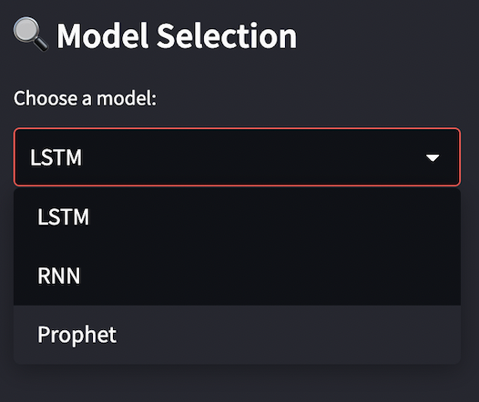
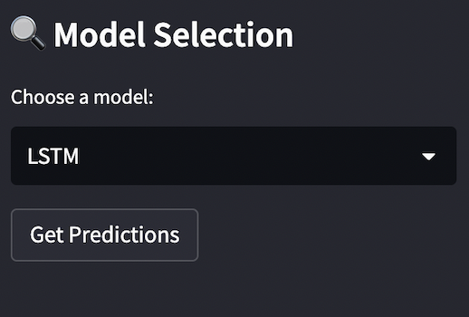
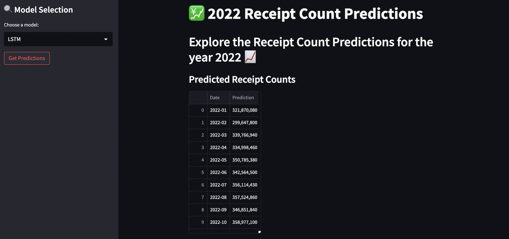

# Fetch Receipt Prediction Repository

## Overview

Welcome to the Fetch Receipt Prediction Repository! This project is focused on predicting the future number of scanned receipts based on historical data. It includes a machine learning model and a user-friendly web application for visualization.

## Problem Statement

The objective is to predict the number of scanned receipts for each month of the year 2022, using daily receipt count data from 2021. This solution demonstrates the application of machine learning techniques and is packaged as a web application for ease of interaction and visualization.

## Repository Structure

- `Streamlit/`
  - `app.py`: The Streamlit application for visualization.
- `main/`
  - `__pycache__/`
  - `__init__.py`
  - `fetch-modeling.ipynb`: Jupyter Notebook for modeling and analysis.
  - `predictions.py`: Script for generating predictions.
  - `train.py`: Training script for ML models.
  - `utils.py`: Utility functions used across the project.
- `results/`: Contains the results of predictions.
  - `LSTM_predictions.csv`
  - `Prophet_predictions.csv`
  - `RNN_predictions.csv`
  - `lstm_predictions1.csv`
  - `rnn_predictions1.csv`
- `trained_models/`: Trained model files.
  - `LSTM.h5`
  - `RNN.h5`
  - `prophet.pkl`
- `unit_tests/`
  - `unit_test.py`: Unit tests for the codebase.
- `Dockerfile`: Docker configuration file.
- `README.md`: Documentation of the project.
- `data_daily.csv`: Dataset used for training and predictions.
- `requirements.txt`: Required libraries and dependencies.

## How to Run

### Web Application

1. **Build Docker Image:**
   Run `docker build -t receipt-prediction-app .` in the terminal to build the Docker image from the Dockerfile.

2. **Run Docker Container:**
   Use `docker run -p 8501:8501 receipt-prediction-app` to start the Docker container, mapping port 8501.

3. **Access the Application:**
   Open your web browser and go to `http://localhost:8501` to interact with the application.

### Using the Application

- Select the desired model via the sidebar.

- Click "Get Predictions" to load and view the predictions.

- Interactive graphs and data tables will display the predicted receipt counts.

## Models Used

1. **LSTM (Long Short-Term Memory)** : Ideal for time series data due to its ability to remember long-term dependencies.
2. **RNN (Recurrent Neural Network)** : Another excellent choice for time series, focusing on the sequential aspect of the data.
3. **Prophet (by Facebook)**: Developed by Facebook, it's great for forecasting with daily observations that display patterns on different time scales.

Each model offers unique perspectives on the prediction task.

## Contributions

Contributions and feedback are welcome. Feel free to open issues or submit pull requests on our GitHub repository.

## Contact

For inquiries, please email [ekanshtrivedi1509@gmail.com](ekanshtrivedi1509@gmail.com).
